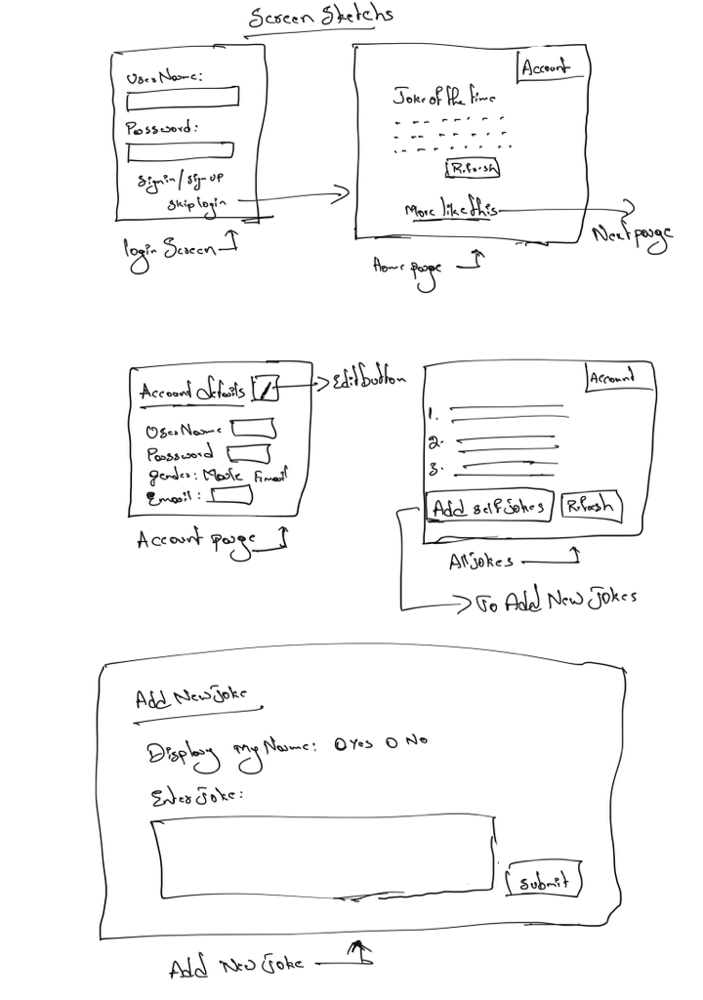

# Smile Maker
## Statement of Purpose
The main purpose of this application is to make people laugh whenever they open this application and they are capable of adding and editing their own jokes.The application is completely userfriendly to make people to use and secured with login authentication inorder to secure his own data while he/she adding or editing their own jokes.

## Objective
This app shows up a joke every time when the user opens it. The user can login, submit and edit a joke as it's a user-friendly app. It is multi-responsive and easy to handle. Smile maker is the prograssive web app, that helps to see the joke which are loaded from the global api. And one custom api which will be used to add or edit his/her own jokes using his/her login's.

## Client
- Dr. Denise Case
- Assistant Professor,Northwest Missouri State University
- 44691-02 Graduate Directed Project
- Fall 2021
## Team Members and their roles

- [Giridhar Addagalla](https://github.com/giridhar196/giridhar196) - Product Owner
- [Tejaswi Reddy Nallavolu](https://github.com/tejaswinallavolu) - Requirement specialist
- [Priyanka Thambabathula](https://github.com/Priyanka1818/Priyanka1818) - Product adviser
- [Vyshnavi Tadipaneni](https://github.com/vyshnavi1996) - Decision maker

## Functional Requirements

## Entities

### User
     - Email
     - Password
     - CreatedOn
     - Gender
     - UserType
     - UserName
     - Name

### Jokes-Api
    - UserName
    - DateOfSubmit
    - Joke-String
    - IsActive
    - Name
### ER Diagram

### Mockup Screen
  
 
## Bidder Qualifications
## Performance Metrics
## Schedule Duration
18-Aug-2021 to 5-Dec-2021 Requirement Gathering, Specifications and basic mockup designs.
12-jan-2022 to 15-Apr-2022 Development,Testing and Release.
## Development Details
